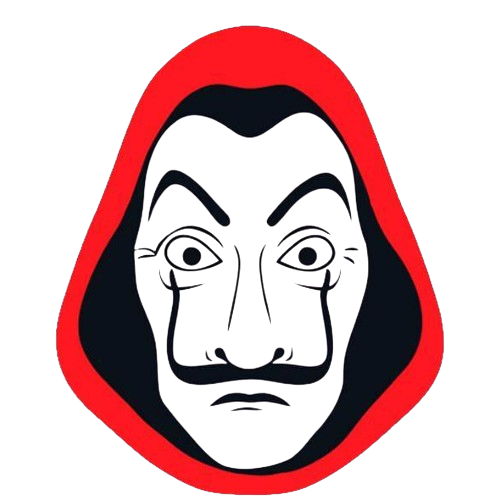

# La case de paple   


## description 
La casa de paple is an app that make fans know information about there favorit characters in the series 


1. [Installation](#installation)
2. [Usage](#usage)
3. [Images](#images)
4. [Video Demo](#video-demo)

   
## Installation 
1. Clone the repository:
   
    ```sh
    git clone https://github.com/KhaledElalfy1/la-casa-de-papel.git
    ```

2. Navigate to the app directory:
    ```sh
    cd la-casa-de-papel
    ```

3. Clean the project and install dependencies:
    ```sh
    flutter clean
    flutter pub get
    ```

## Additional Steps for Best Experience
4. Change the app icon:
    ```sh
    flutter pub get
    flutter pub run flutter_launcher_icons
    ```
    ## usage
     To run the project, use the following command:
     ```sh
       flutter run
     ```

## Images


## Video Demo

https://github.com/user-attachments/assets/47aea627-ecb8-4103-940a-1b8bc0b06613


     
